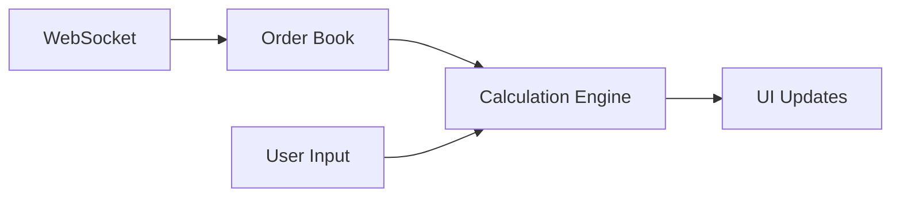

# Trading Simulator with Market Impact Analysis

A high-performance trading simulator that implements advanced market impact models, regression-based slippage estimation, and maker/taker proportion prediction.

## Table of Contents
- [Overview](#overview)
- [Architecture](#architecture)
- [Models Implementation](#models-implementation)
- [Optimization Techniques](#optimization-techniques)
- [Performance Metrics](#performance-metrics)
- [Installation](#installation)
- [Usage](#usage)
- [Contributing](#contributing)

## Overview

This project implements a real-time trading simulator with advanced market impact analysis capabilities. It uses the Almgren-Chriss model for market impact estimation, logistic regression for maker/taker proportion prediction, and quantile regression-inspired logic for slippage estimation.

## Architecture

### Core Components
- **WebSocket Client**: Real-time market data processing
- **Calculation Engine**: Market impact and fee calculations
- **UI Layer**: wxWidgets-based graphical interface
- **Thread Management**: Asynchronous data processing

### Data Flow


## Models Implementation

### 1. Almgren-Chriss Market Impact Model
```cpp
double calculateMarketImpact(
    double quantity_usd,
    double volatility,
    const std::vector<OrderBookLevel>& asks,
    const std::vector<OrderBookLevel>& bids,
    double slippage_pct,
    double permanent_impact = 2.5e-6,
    double temporary_impact = 2.5e-6
)
```

#### Components:
- **Temporary Impact**: η * sqrt(quantity) * midPrice
- **Permanent Impact**: θ * quantity * midPrice
- **Volatility Adjustment**: Based on market conditions
- **Depth Adjustment**: Based on order book liquidity

### 2. Regression Models

#### Slippage Estimation
```cpp
double estimateExpectedSlippage(
    double quantity_usd,
    double volatility,
    double feeTier,
    const std::vector<OrderBookLevel>& asks,
    const std::vector<OrderBookLevel>& bids,
    double k_vol = 0.1
)
```

Features:
- Order book depth analysis
- Volatility adjustment
- Fee tier consideration
- Quantile-based estimation

#### Maker/Taker Proportion
```cpp
double calculateMakerTakerProportion(
    const std::vector<OrderBookLevel>& asks,
    const std::vector<OrderBookLevel>& bids
)
```

Features:
- Volume-based analysis
- Price spread patterns
- Market depth consideration
- Logistic regression implementation

## Optimization Techniques

### 1. Memory Management
- **Smart Pointers**: For WebSocket and thread management
- **Vector Pre-allocation**: For order book data structures
- **Move Semantics**: For efficient data transfer
- **RAII**: For resource management

### 2. Network Communication
- **WebSocket Optimization**:
  - Binary message format
  - Compression enabled
  - Connection pooling
  - Automatic reconnection

### 3. Data Structure Selection
- **Order Book**: `std::vector<OrderBookLevel>` for efficient iteration
- **Fee Tiers**: Static map for O(1) lookups
- **Metrics**: Vector for contiguous memory access

### 4. Thread Management
```cpp
class WebSocketThread : public wxThread {
    // Thread-safe parameter handling
    std::mutex mutex;
    std::atomic<bool> needs_reconnect{false};
}
```

Features:
- Thread-safe parameter updates
- Atomic operations for flags
- Mutex-protected shared resources
- Event-based UI updates

### 5. Regression Model Efficiency
- **Feature Selection**: Optimized for real-time processing
- **Matrix Operations**: Efficient vector operations
- **Caching**: Frequently used calculations
- **Batch Processing**: For historical data analysis

## Performance Metrics

### Latency Measurements
- **Calculation Time**: Market impact and fee calculations
- **UI Update Time**: Display refresh latency
- **Network Latency**: WebSocket communication

### Memory Usage
- **Order Book**: ~100KB per snapshot
- **Calculation Engine**: ~1MB peak
- **UI Layer**: ~10MB total

## Installation

### Prerequisites
- C++17 or later
- wxWidgets 3.1+
- CMake 3.15+
- IXWebSocket library

### Build Instructions
```bash
mkdir build
cd build
cmake ..
make
```

## Usage

### Configuration
```cpp
struct TradingParams {
    wxString exchange = "OKX";
    wxString asset = "BTC-USDT-SWAP";
    wxString order_type = "market";
    wxString quantity = "500.0";
    wxString volatility = "0.02";
    wxString fee_tier = "1";
}
```

### Running
```bash
./trading_sim
```

## License

This project is licensed under the MIT License - see the LICENSE file for details.

## Acknowledgments

- Almgren-Chriss model implementation
- wxWidgets for UI framework
- IXWebSocket for network communication 